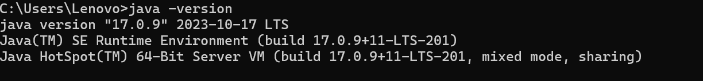

## Selenium

Es una herramienta de **automatización de pruebas** de código abierto diseñada para probar aplicaciones web. Permite a los testers y desarrolladores crear scripts para automatizar las interacciones de usuario en navegadores como Chrome, Firefox, Safari, y Edge, simulando acciones como clics, entrada de texto y navegación entre páginas.

### Componentes principales de Selenium

- **Selenium WebDriver**: Es una **librería** que permite escribir scripts en varios lenguajes de programación (como Java, Python, C#, y JavaScript) y controlar el navegador directamente. Es ideal para pruebas funcionales y de interfaz de usuario en aplicaciones web.
    
- **Selenium IDE**: Una **herramienta de grabación y reproducción** de pruebas que permite a los usuarios crear scripts sin necesidad de escribir código. Es útil para crear scripts rápidos, pero con funcionalidades limitadas.
    
- **Selenium Grid**: Permite ejecutar pruebas en varios navegadores y sistemas operativos simultáneamente. Es útil para realizar pruebas de compatibilidad en distintos entornos y acelerar el tiempo de ejecución de las pruebas.

## Cucumber

Es una librería que nos permite escribir en un lenguaje no técnico (Gherkin) describiendo los requisitos de una aplicación en una forma legible. Cucumber permite documentar el comportamiento de nuestro sistema al mismo tiempo en el que se están creando los casos de prueba. (Documentación viva, casos de prueba, reportes en un solo lugar).


### Características Clave de Cucumber

- **BDD (Behavior-Driven Development)**: Cucumber está diseñado para usarse en desarrollo dirigido por comportamiento (BDD). BDD es una metodología en la que se definen las especificaciones de software basadas en el comportamiento esperado de la aplicación, facilitando una colaboración cercana entre los desarrolladores, testers y el cliente.
- **Escritura en Lenguaje Natural (Gherkin)**: Las pruebas en Cucumber se escriben en un lenguaje simple y estructurado llamado Gherkin, que permite describir los escenarios de prueba en inglés u otros idiomas. Los escenarios de prueba usan una estructura de “Given-When-Then”:


```gherkin
Feature: Inicio de sesión en la aplicación
  Scenario: Usuario inicia sesión con credenciales válidas
    Given el usuario está en la página de inicio de sesión
    When el usuario ingresa sus credenciales correctas
    Then el usuario es redirigido al panel principal
```


## Gradle

Herramienta para gestionar la construcción, prueba, empaquetado y despliegue de aplicaciones. 
### Cómo Funciona Gradle

- **Build Scripts (`build.gradle`)**: Los proyectos en Gradle se configuran a través de archivos de script llamados `build.gradle` (para Groovy) o `build.gradle.kts` (para Kotlin). En estos archivos, se definen tareas como compilar, probar, empaquetar o ejecutar la aplicación.
- **Tareas**: Gradle organiza el proceso de construcción en “tareas” (`tasks`), que son acciones individuales, como compilar el código o ejecutar pruebas. Puedes ejecutar tareas específicas (ej. `gradle build`, `gradle test`) o agruparlas en flujos de trabajo.
- **Dependencias**: En el archivo de configuración, puedes especificar dependencias externas que Gradle descargará automáticamente. Esto permite gestionar versiones de librerías y facilita el mantenimiento de dependencias en el proyecto.


## Sesion Práctica Selenium WebDriver + Cucumber para pruebas funcionales


## Instalaciones

1. Descargar y configurar el JDK (**Windows**):

- **Descargar JDK:**
        - Ve al sitio web oficial de Oracle ([oracle.com](https://www.oracle.com/java/technologies/downloads/)) y descarga el instalador del JDK adecuado para tu versión de Windows (32 o 64 bits).
        
- **Ejecutar el Instalador:**
        - Abre el archivo descargado y sigue las instrucciones del instalador. Durante la instalación, puedes cambiar la ruta de instalación o dejarla por defecto.
        
- **Configurar el PATH (Opcional):**
        - Para poder ejecutar Java desde cualquier lugar en la línea de comandos, debes agregar la ruta del JDK al PATH de tu sistema.
        - Busca "Variables de entorno" en la configuración del sistema y agrega la ruta del directorio bin del JDK (por ejemplo, C:\Program Files\Java\jdk-11\bin) a la variable PATH.

2. Gradle

- **Descargar el instalador**: Ve a la página oficial de [gradle.org](https://gradle.org/install/) descarga y ejecuta el instalador
- **Extrae el Archivo ZIP**: Descomprime el archivo ZIP descargado en una carpeta en tu sistema, por ejemplo, `C:\Gradle`, la carpeta descomprimida debe contener subcarpetas como `bin` y `lib`
- **Configura la variable de entorno**: 
	- Abre el menú **Inicio**, escribe `variables de entorno`, y selecciona **Editar las variables de entorno del sistema**.
	- En la ventana de Propiedades del sistema, haz clic en **Variables de entorno**.
	- En **Variables del sistema**, busca la variable `Path` y haz clic en **Editar**.
	- Haz clic en **Nuevo** e ingresa la ruta de la carpeta `bin` de Gradle, por ejemplo: `C:\Gradle\gradle-<versión>\bin`.
	- Haz clic en **Aceptar** en todas las ventanas para guardar los cambios

3. Verifica la instalación:
- Ve a tu ventana de comandos y escribe:

```
java -version

gradle -v
```

Deberías obtener una respuesta así: 




4. Extensiones:
- Abre Visual Studio Code e instala las siguientes extensiones:

	

	

	

	

	

	
5. ChromeWebDriver

## Primer proyecto

1. Abrir VSC y en la paleta de comandos escribir Java > Seleccionar la opción Gradle: Create a Gradle Java Project > Seleccionar  la carpeta de tu preferencia donde se creará el proyecto> Selecionar Groovy > Dar un nombre al proyecto > Enter. 


2. Organiza tu proyecto:
- Saca la carpeta src de app
- Borra los archivos App.java y AppTest.java
- Verifica que tu proyecto cuente con un archivo build.gradle, sino es así, crealo e inserta las siguientes configuraciones:

```build.gradle
plugins {

    id 'java' // Agrega el plugin de Java para habilitar tareas como build y clean

}

  

group = 'com.example'

version = '1.0-SNAPSHOT'

 
repositories {

    mavenCentral() // Repositorio para dependencias

}

 dependencies {

    // Dependencias para el proyecto, agrega aquí si necesitas alguna

    testImplementation 'junit:junit:4.13.2' // Ejemplo de dependencia para pruebas

  

    // https://mvnrepository.com/artifact/io.github.bonigarcia/webdrivermanager

    implementation 'io.github.bonigarcia:webdrivermanager:5.9.2'

  

    // https://mvnrepository.com/artifact/org.seleniumhq.selenium/selenium-java

    implementation 'org.seleniumhq.selenium:selenium-java:4.25.0'

  

    // https://mvnrepository.com/artifact/org.testng/testng

    testImplementation 'org.testng:testng:7.10.2'

  

    // https://mvnrepository.com/artifact/io.cucumber/cucumber-java

    implementation 'io.cucumber:cucumber-java:7.20.1'

  

    // https://mvnrepository.com/artifact/io.cucumber/cucumber-junit

    testImplementation 'io.cucumber:cucumber-junit:7.20.1'

  
  

}

  

// Configura la versión de Java

java {

    toolchain {

        languageVersion = JavaLanguageVersion.of(17) // Cambia a tu versión de Java

    }

}

```
[Maven](https://mvnrepository.com/)
- Desde tu terminal ejecuta

```
gradle build
```

```
gradle clean
```

o desde la extensión para gradle:


3.  Crea el archivo principal de tu proyecto en este caso CoffeTech.java en el carpeta pages con este código: 

```java

package pages;
 

import org.openqa.selenium.WebDriver;
import org.openqa.selenium.chrome.ChromeDriver;
import org.testng.annotations.AfterMethod;
import org.testng.annotations.BeforeMethod;
import org.testng.annotations.Test;
import io.github.bonigarcia.wdm.WebDriverManager;

public class CoffeeTech {
    private WebDriver driver;


    @BeforeMethod
    public void setUp() {
        // Inicializa el WebDriver para Chrome
        WebDriverManager.chromedriver().setup();
        driver = new ChromeDriver();
    }

    @Test
    public void navegamosAFreeRangeTesters() throws InterruptedException {

        // Navega a la página web
        driver.get("https://coffeetech.netlify.app");
        // Pausa de 5 segundos para ver la página
        Thread.sleep(5000);
    }

  

    @AfterMethod
    public void tearDown() {
        // Cierra el navegador después de la prueba
        if (driver != null) {
            driver.quit();
        }
    }
}
```

Ejecuta la prueba dando clic en el botón verde al lado de test, verás como se abre una ventana de Chrome en nuestra página de prueba https://coffeetech.netlify.app. En la terminal podrás ver los resultados de la prueba mostrando un icono de check cuando la prueba es exitosa. 


